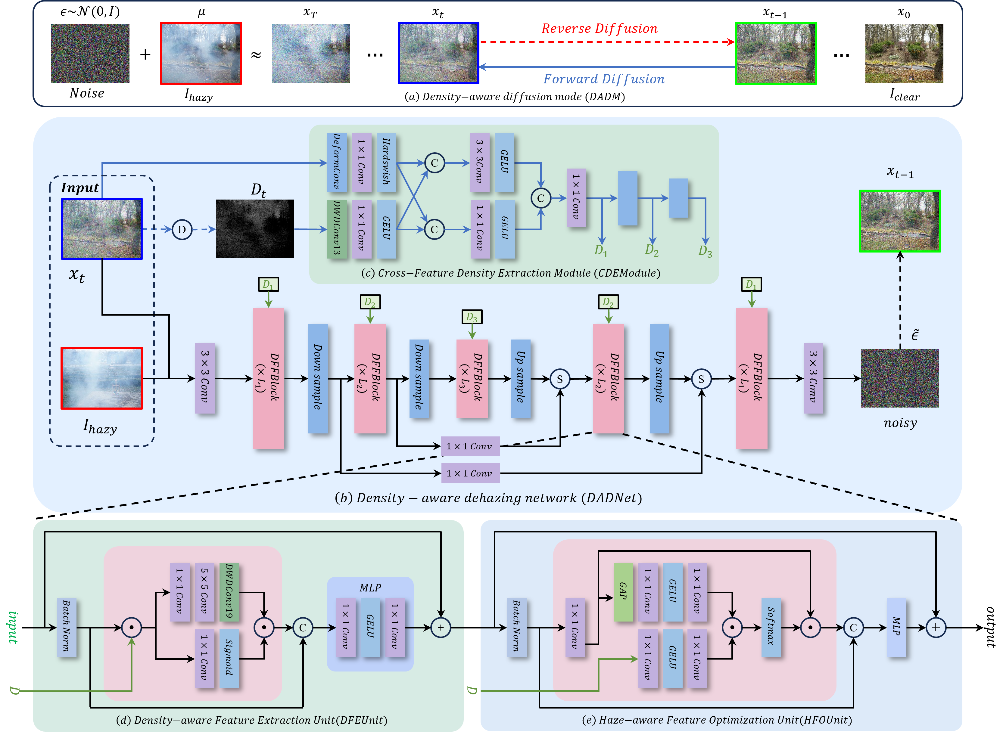
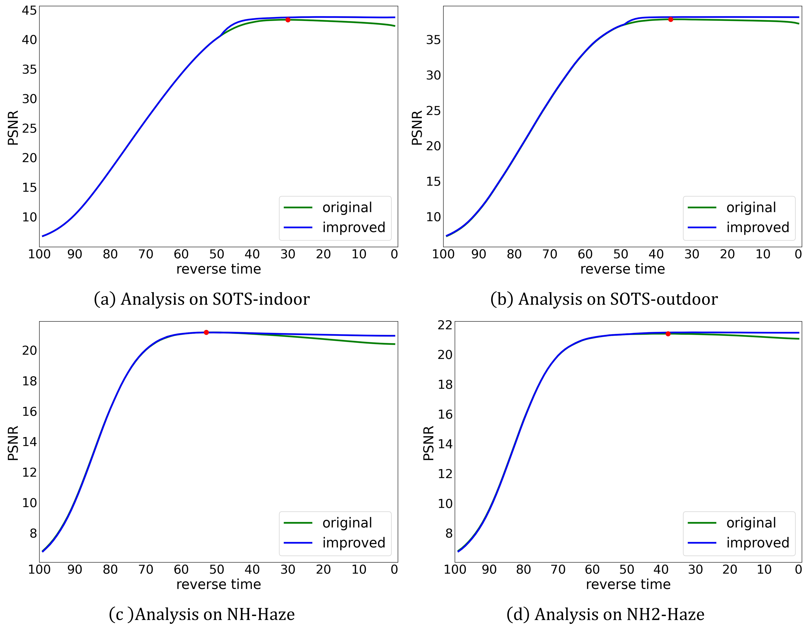
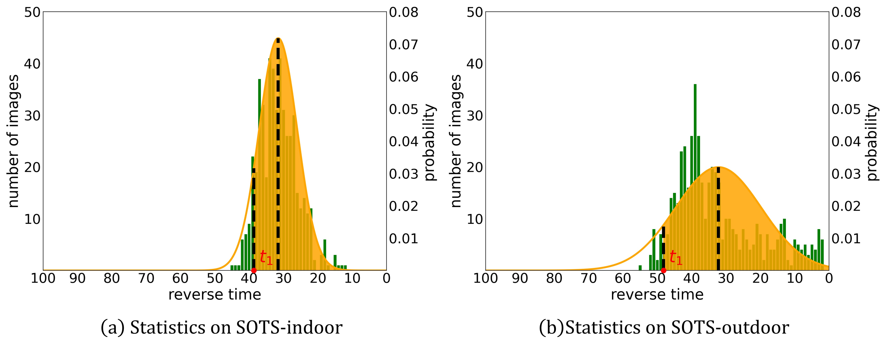
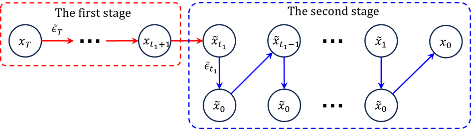
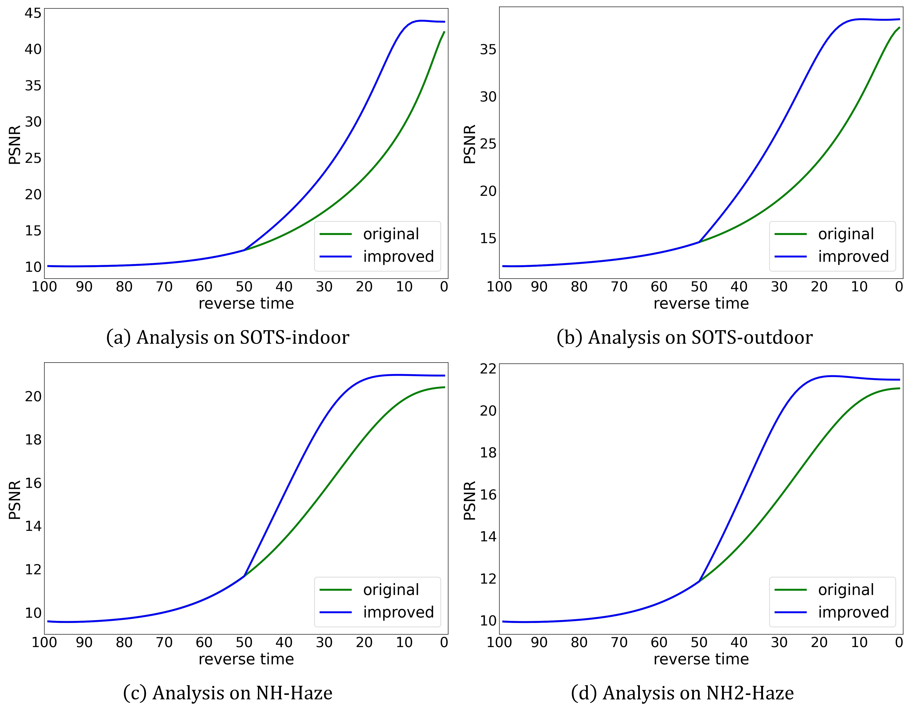

# DADM
##### Density-Aware Diffusion Model for Efficient Image Dehazing

### 1. Our Result comparison with other methods.

> Guided by the haze density, our DADM can handle images with dense haze and complex environments.


### 2. Overview of our DADM. 

> * For image dehazing, the haze image can be considered as noisy data, while the clear haze-free image is the target data. By training a diffusion model, we can learn a mapping from haze images to haze-free images. The diffusion model contains a forward diffusion process and a reverse diffusion process.
> * In the reverse diffusion process of our DADM, we introduce a density-aware dehazing network (DADNet) to estimate the noise in the input image and recover a haze-free image from a haze image (considered as a noisy state).



### 3. The haze density of the mage.

> The dark channel value of noise areas is also very low, resulting in the inability to extract accurate haze density information. We introduce a cross-feature density extraction module (CDEModule) to optimize the dark channel map and obtain the accurate haze density for the image.


#### 4. Analysis of the test sampling process on four datasets.

>  The dehazing results have achieved an optimum at some intermediate time point, while the image quality may instead degrade as the dehazing process continues.



### 5. Statistics on Datasets.

> We evaluate all the sampling results at various time steps using the PSNR values against the ground truth. Based on the mean value $t_2$ and the variance $\sigma$ of the distribution, we can plot the corresponding normal distribution curves $c \sim \mathcal{N}(t_2, \sigma^2)$. Next, we set a criterion that the area under the corresponding normal distribution curve from $t_1$ to $t=0$ is 90\% of the total area.



#### 6. Sampling process for testing.

> We use $t_1$ as the dividing time point. t > $t_1$ is the first stage, while t ≤ $t_1$ is the second stage. These two stages use different sampling methods.



#### 7. Analysis of xt on four datasets.

> We evaluate the PSNR vaules between $x_t$ and ground-truth for each time step on four datasets.



#### 8. Visual Comparison with IR-SDE.

> We compared our methods with IR-SDE.


# Dependenices Version

* OS:                      Ubuntu 20.04.6
* nvdia:                   11.6
* python:                  3.7.1
* pytorch:                 1.13.0

# How to train?

### datasets preparation and parameters configuration
> You can directly configure the hazy and GT paths of the dataset and other parameters in the corresponding files under the Option folder. 
> We have configured four different types of processing methods for different types of data sets hazy image and gt image formats.
* indoor
* outdoor
* NH_Haze
* NH-Haze2

### train
```bash
bash train.sh
```

### test
```bash
bash test.sh
```
