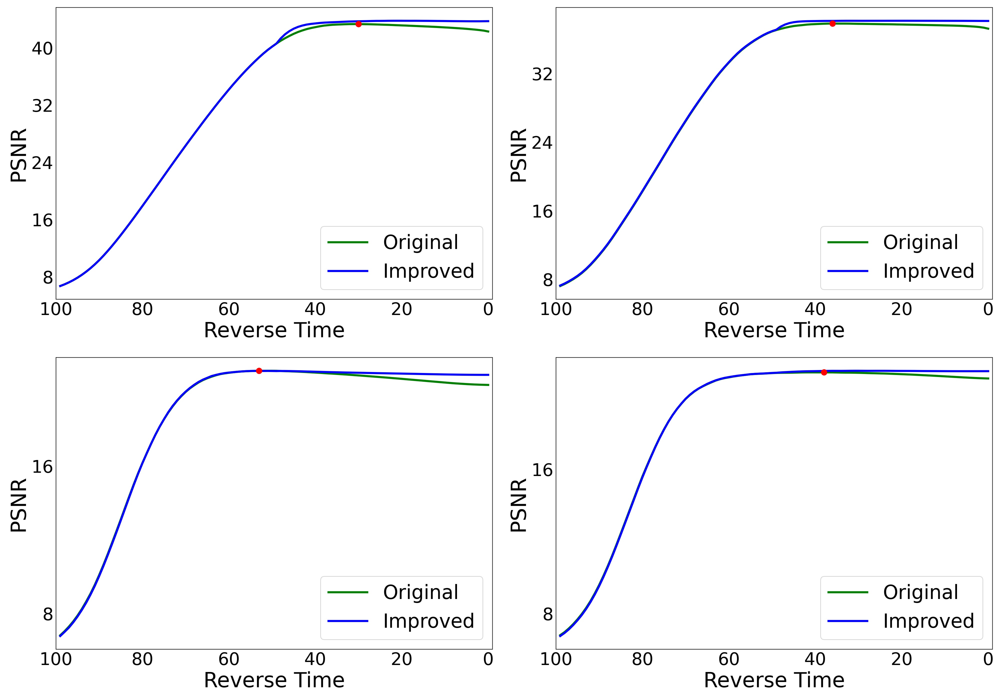
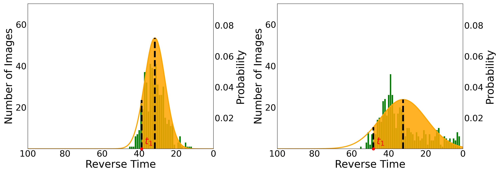

# DADM
Density-Aware Diffusion Model for Efficient Image Dehazing

### Our Result.

### Overview of our DADM. 

### The haze density of the mage

### Analysis of the test sampling process on four datasets.

### Statistics on Datasets 

### Sampling process for testing.

### Analysis of xt on four datasets.

### Visual Comparison with IR-SDE.

DCNv2                   0.1          /mnt/data/baiwenxu/Anaconda3/envs/pytorch/lib/python3.7/site-packages/DCNv2-0.1-py3.7-linux-x86_64.egg
docker                  5.0.3
einops                  0.6.1
matplotlib              3.5.1
numpy                   1.19.5
opencv-python           4.5.5.64
pandas                  1.3.5
Pillow                  9.0.1
PyYAML                  6.0
scikit-image            0.19.2
scikit-learn            1.0.2
scipy                   1.7.3
timm                    0.6.7
torch                   1.13.0+cu116
torchaudio              0.13.0+cu116
torchvision             0.14.0+cu116
tqdm                    4.32.2

| NVIDIA-SMI 550.54.14              Driver Version: 550.54.14      CUDA Version: 12.4     |
|   0  NVIDIA GeForce RTX 3090        Off |   00000000:1B:00.0 Off |                  N/A |

Python 3.7.1
Description:    Ubuntu 20.04.6 LTS

