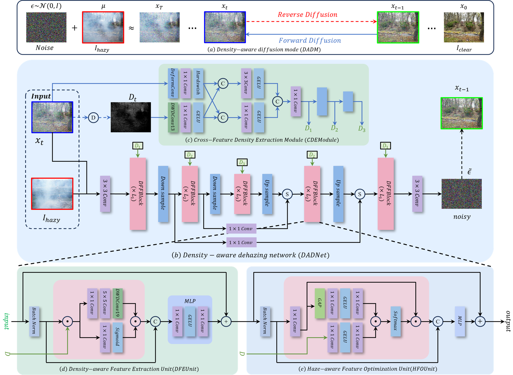
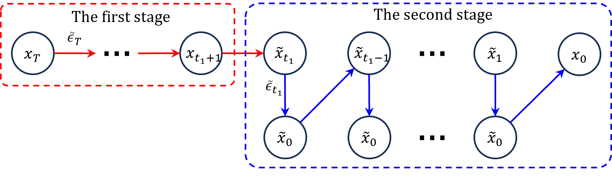

# DADM
Density-Aware Diffusion Model for Efficient Image Dehazing

### 1. Our Result comparison with other methods.

### 2. Overview of our DADM. 

### 3. The haze density of the mage.

### 4. Analysis of the test sampling process on four datasets.

### 5. Statistics on Datasets.

### 6. Sampling process for testing.

### 7. Analysis of xt on four datasets.

### 8. Visual Comparison with IR-SDE.

