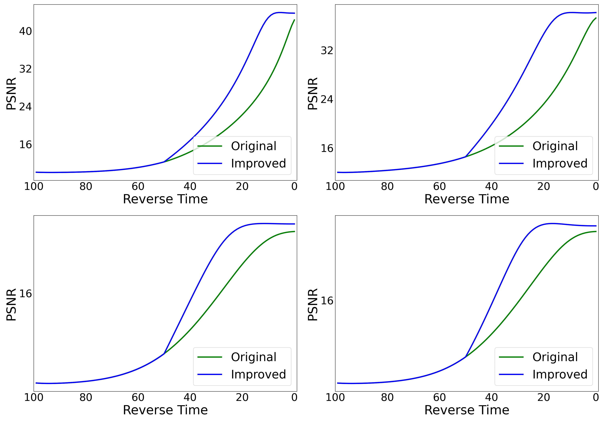

# DADM
Density-Aware Diffusion Model for Efficient Image Dehazing

### Our Result.

### Overview of our DADM. 

### The haze density of the mage

### Analysis of the test sampling process on four datasets.

### Statistics on Datasets 

### Sampling process for testing.

### Analysis of xt on four datasets.

### Visual Comparison with IR-SDE.

absl-py                 1.0.0
addict                  2.4.0
aiohttp                 3.7.0
appdirs                 1.4.4
asttokens               2.2.1
astunparse              1.6.3
async-timeout           3.0.1
attrs                   21.4.0
beautifulsoup4          4.12.2
blessed                 1.20.0
blinker                 1.4
blobfile                2.0.1
Bottleneck              1.3.4
brotlipy                0.7.0
cachetools              5.0.0
certifi                 2021.10.8
cffi                    1.15.0
chardet                 3.0.4
charset-normalizer      2.0.4
click                   8.1.2
cryptography            36.0.0
cycler                  0.11.0
DCNv2                   0.1          /mnt/data/baiwenxu/Anaconda3/envs/pytorch/lib/python3.7/site-packages/DCNv2-0.1-py3.7-linux-x86_64.egg
docker                  5.0.3
docker-pycreds          0.4.0
dominate                2.7.0
einops                  0.6.1
filelock                3.10.0
Flask                   2.2.3
fonttools               4.25.0
gdown                   4.7.1
gitdb                   4.0.10
GitPython               3.1.31
google-auth             2.6.6
google-auth-oauthlib    0.4.6
gpustat                 1.1.1
grpcio                  1.38.1
grpcio-tools            1.46.1
guided-diffusion        0.0.0
h5py                    2.10.0
hilbertcurve            2.0.5
idna                    3.3
imageio                 2.5.0
importlib-metadata      6.7.0
itsdangerous            2.1.2
Jinja2                  3.1.2
joblib                  1.1.0
jsonpatch               1.33
jsonpointer             2.4
kiwisolver              1.3.2
kmeans-pytorch          0.3
kornia                  0.6.7
lmdb                    1.4.0
lpips                   0.1.4
lxml                    4.9.2
Markdown                3.3.6
MarkupSafe              2.1.2
matplotlib              3.5.1
mindspore               1.10.0
mkl-fft                 1.3.0
mkl-random              1.1.1
mkl-service             2.3.0
mmcv-full               1.7.1
mpi4py                  3.1.4
multidict               6.0.2
munkres                 1.1.4
natsort                 8.4.0
networkx                2.6.3
nltk                    3.7
numexpr                 2.7.3
numpy                   1.19.5
nvidia-ml-py            12.535.133
oauthlib                3.2.0
opencv-python           4.5.5.64
packaging               21.3
pandas                  1.3.5
pathtools               0.1.2
Pillow                  9.0.1
pip                     23.2.1
piq                     0.6.0
platformdirs            4.0.0
protobuf                3.18.0
psutil                  5.9.4
ptflops                 0.7
pyasn1                  0.4.8
pyasn1-modules          0.2.7
pycocotools             2.0.4
pycparser               2.21
pycryptodomex           3.17
PyJWT                   2.3.0
pyOpenSSL               22.0.0
pyparsing               3.0.4
PySocks                 1.7.1
python-dateutil         2.8.2
pytorch-msssim          1.0.0
pytz                    2021.3
pyu2f                   0.1.5
PyWavelets              1.3.0
PyYAML                  6.0
regex                   2022.6.2
requests                2.27.1
requests-oauthlib       1.3.1
rsa                     4.8
scikit-image            0.19.2
scikit-learn            1.0.2
scipy                   1.7.3
sentry-sdk              1.24.0
setproctitle            1.3.2
setuptools              61.2.0
six                     1.16.0
smmap                   5.0.0
soupsieve               2.4.1
tensorboard             2.8.0
tensorboard-data-server 0.6.0
tensorboard-logger      0.1.0
tensorboard-plugin-wit  1.8.1
tensorboardX            2.5
threadpoolctl           3.1.0
tifffile                2021.11.2
timm                    0.6.7
tomli                   2.0.1
torch                   1.13.0+cu116
torch-tb-profiler       0.4.0
torchaudio              0.13.0+cu116
torchsummaryX           1.3.0
torchtext               0.4.0
torchvision             0.14.0+cu116
tornado                 6.1
tqdm                    4.32.2
typing_extensions       4.7.1
urllib3                 1.26.16
visdom                  0.2.4
wandb                   0.15.3
warmup-scheduler        0.3
wcwidth                 0.2.13
websocket-client        1.3.2
Werkzeug                2.2.3
wheel                   0.37.1
yapf                    0.40.2
yarl                    1.6.0
zipp                    3.8.0

+-----------------------------------------------------------------------------------------+
| NVIDIA-SMI 550.54.14              Driver Version: 550.54.14      CUDA Version: 12.4     |
|-----------------------------------------+------------------------+----------------------+
| GPU  Name                 Persistence-M | Bus-Id          Disp.A | Volatile Uncorr. ECC |
| Fan  Temp   Perf          Pwr:Usage/Cap |           Memory-Usage | GPU-Util  Compute M. |
|                                         |                        |               MIG M. |
|=========================================+========================+======================|
|   0  NVIDIA GeForce RTX 3090        Off |   00000000:1B:00.0 Off |                  N/A |
| 60%   70C    P2            278W /  350W |    9567MiB /  24576MiB |     81%      Default |
|                                         |                        |                  N/A |
+-----------------------------------------+------------------------+----------------------+
|   1  NVIDIA GeForce RTX 3090        Off |   00000000:3E:00.0 Off |                  N/A |
| 30%   29C    P8             19W /  350W |      12MiB /  24576MiB |      0%      Default |
|                                         |                        |                  N/A |
+-----------------------------------------+------------------------+----------------------+
|   2  NVIDIA GeForce RTX 2080 Ti     Off |   00000000:88:00.0 Off |                  N/A |
| 40%   30C    P8              6W /  257W |       8MiB /  11264MiB |      0%      Default |
|                                         |                        |                  N/A |
+-----------------------------------------+------------------------+----------------------+
|   3  NVIDIA GeForce RTX 2080 Ti     Off |   00000000:89:00.0 Off |                  N/A |
| 42%   47C    P2             79W /  260W |    6832MiB /  11264MiB |     18%      Default |
|                                         |                        |                  N/A |
+-----------------------------------------+------------------------+----------------------+
|   4  NVIDIA GeForce RTX 3090        Off |   00000000:B1:00.0 Off |                  N/A |
| 33%   63C    P2            211W /  350W |   22999MiB /  24576MiB |    100%      Default |
|                                         |                        |                  N/A |
+-----------------------------------------+------------------------+----------------------+
|   5  NVIDIA GeForce RTX 3090        Off |   00000000:B2:00.0 Off |                  N/A |
| 49%   50C    P2            194W /  350W |   23641MiB /  24576MiB |     90%      Default |
|                                         |                        |                  N/A |
+-----------------------------------------+------------------------+----------------------+

user                           Sun Aug  4 19:40:30 2024  550.54.14
[0] NVIDIA GeForce RTX 3090    | 70°C,  68 % |  9567 / 24576 MB | chengliang(9552M) gdm(4M)
[1] NVIDIA GeForce RTX 3090    | 30°C,   0 % |    12 / 24576 MB | gdm(4M)
[2] NVIDIA GeForce RTX 2080 Ti | 30°C,   0 % |     8 / 11264 MB | gdm(4M)
[3] NVIDIA GeForce RTX 2080 Ti | 46°C,  12 % |  6832 / 11264 MB | chengliang(6824M) gdm(4M)
[4] NVIDIA GeForce RTX 3090    | 58°C,   0 % | 22999 / 24576 MB | baichang(22982M) gdm(4M)
[5] NVIDIA GeForce RTX 3090    | 40°C,   0 % | 23641 / 24576 MB | baichang(23624M) gdm(4M)
